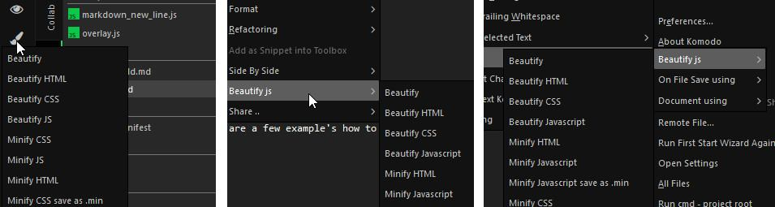
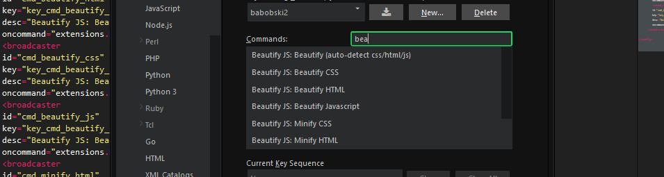
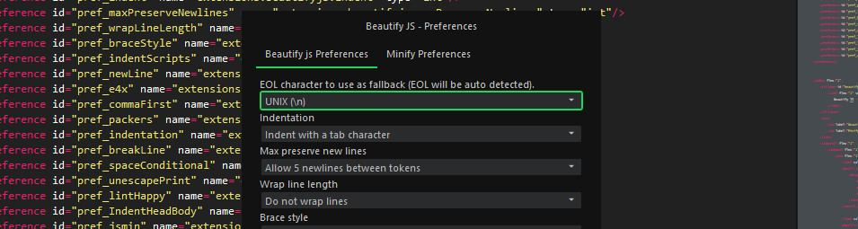

# Beautify JS
js beautify for komodo edit/ide.

This little beautifier will reformat/minify css, html and javascript.  
Based on the the [jsbeautifier.org](http://jsbeautifier.org/).

## options
 - **Beautify (auto detect)**  
	Beautify HTML/CSS/javascript (this will be auto-detected).  
	*Selection or document*
 - **Beautify HTML**  
	Beautify HTML.  
	*Selection or document*
 - **Beautify CSS**  
	Beautify CSS.  
	*Selection or document*  
 - **Beautify Javascript**  
	Beautify javascript.  
	*Selection or document*
 - **Minify HTML**  
	Minify HTML.  
	*Selection or document*  
 - **Minify Javascript**  
	Minify javascript.  
	*Selection or document*
 - **Minify Javascript save as .min**  
	Minify javascript and save it as .min file.  
	*document*  
 - **Minify CSS**  
	Minify CSS.  
	*Selection or document*  
 - **Minify CSS save as .min**  
	Minify CSS and save it as .min file.  
	*document*  
 - **Beautify Settings**  
	This will open the settings window.  
	*Selection or document*

## Access

These option are availible under **Tools > Beautify JS** or in the context menu of the current file.  

In Komodo Ide you also have a dynamic button and is Beautify JS added to the **Code > Format** menu.  

  

## Key Bindings  
You can set up key bindings for all of the available beautify options.



## Beautify/minify Options
The option panel, for controlling the beautify and minify options is accessible trough the addon screen.



## Userscripts
You can use beautify js inside a userscript, below are a few example's how to set up such userscript.

```javascript
// Auto detect (JS/HTML/CSS)
if (extensions.beautifyjs) {
    extensions.beautifyjs.beautify();
}
// HTML
if (extensions.beautifyjs) {
    extensions.beautifyjs.beautify_HTML();
}

// CSS
if (extensions.beautifyjs) {
    extensions.beautifyjs.beautify_CSS();
}

// Javascript
if (extensions.beautifyjs) {
    extensions.beautifyjs.beautify_JS();
}

// Minify HTML
if (extensions.beautifyjs) {
    extensions.beautifyjs.htmlMin();
}

// Minify Javascript
if (extensions.beautifyjs) {
    extensions.beautifyjs.jsMin();
}

// Minify CSS
if (extensions.beautifyjs) {
    extensions.beautifyjs.cssMin();
}

// Minify Javascript ans save it as .min
if (extensions.beautifyjs) {
    extensions.beautifyjs.jsMinSave();
}

// Minify CSS ans save it as .min
if (extensions.beautifyjs) {
    extensions.beautifyjs.cssMinSave();
}

```
