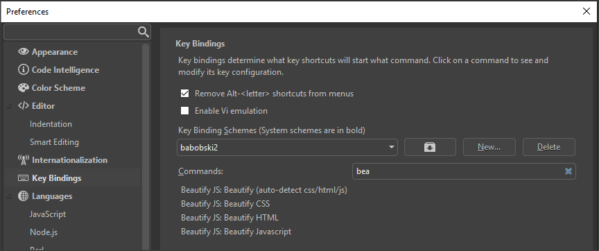

# Beautify js
js beautify for komodo edit/ide.

This little beautifier will reformat css, html and javascript.  
Based on the the <a href="http://jsbeautifier.org/" target="_blank">jsbeautifier.org</a>.

<h2>Usage</h2>
<p><b>Goto to Tools</b> -&gt; <b>Beautify js</b> and select an option, or right-click on your file</p>
<ul>
<li><strong><em>Beautify (auto detect)</em></strong><br>
Beautify selected HTML/CSS/javascript (this will be auto-detected).</li>
<li><strong><em>Beautify HTML</em></strong><br>
Beautify selected HTML.</li>
<li><strong><em>Beautify CSS</em></strong><br>
Beautify selected CSS.</li>
<li><strong><em>Beautify Javascript</em></strong><br> 
Beautify selected javascript.</li>
<li><strong><em>Beautify Settings</em></strong><br> 
This will open the settings window.</li>
</ul>

<h3>Ide only</h3>
Same menu is availible under **code > format > beautify js**

<h2>Options</h2>
The option panel is accessible true the add on screen.<br><br>


<h2>Key Bindings</h2>
You can set up key bindings for all of the available beautify options.  
<b>Preferences > Key Bindings > Beautify</b>


<h2>Userscripts</h2>
You can use beautify js inside a userscript, below are a few example's how to set up such userscript.

```javascript
// AUTO DETECT (JS/HTML/CSS)
if (extensions.beautifyjs) {
    extensions.beautifyjs.beautify();
}
// HTML
if (extensions.beautifyjs) {
    extensions.beautifyjs.beautify_HTML();
}

// CSS
if (extensions.beautifyjs) {
    extensions.beautifyjs.beautify_CSS();
}

// Javascript
if (extensions.beautifyjs) {
    extensions.beautifyjs.beautify_JS();
}
```
To execute beautify on after file save, you can set up this macro (trigger after file safe)
```javascript
(function() {
	if (extensions.beautifyjs) {
		var view    = ko.views.manager.currentView;
		var scimoz  = view.scimoz;
		var notify	= require("notify/notify");
	
		// if no current view is open
		if (view === null){
			return false;
		}
	
		// if file isn't saved we cant get it's extension
		var file = view.koDoc.file;
		if (file === null) {
			return false;
		}
		
		
		switch (file.ext) {
			case '.html':
			case '.xhtml':
				try {
					extensions.beautifyjs.beautify_HTML();
				} catch(e) {
					notify.send('Error: ' + e.message, 'tools');
				}
				break;
			case '.css':
				try {
					extensions.beautifyjs.beautify_CSS();
				} catch(e) {
					notify.send('Error: ' + e.message, 'tools');
				}
				break;
			case '.js':
				try {
					extensions.beautifyjs.beautify_JS();
				} catch(e) {
					notify.send('Error: ' + e.message, 'tools');
				}
				break;
			default:
				return;
				break;
		}
		
		try {
			ko.commands.doCommand('cmd_save');
		} catch(e) {
			notify.send('Error: ' + e.message, 'tools');
		}
        
	}
	
}).apply();
```
